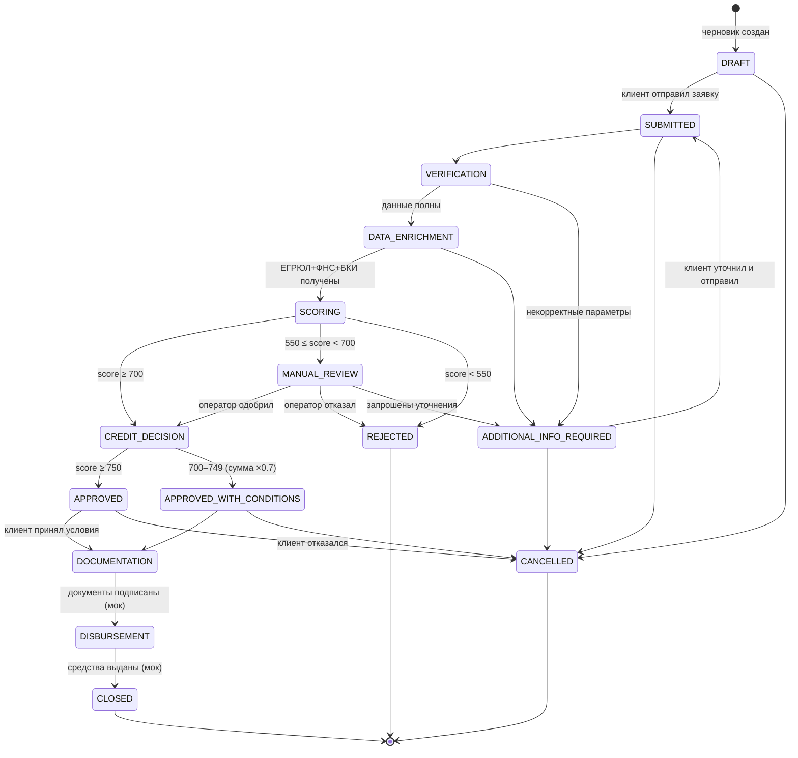

# Диаграмма состояний заявки

```mermaid
stateDiagram-v2
    [*] --> DRAFT : черновик создан
    DRAFT --> SUBMITTED : клиент отправил заявку
    DRAFT --> CANCELLED
    SUBMITTED --> VERIFICATION
    SUBMITTED --> CANCELLED
    VERIFICATION --> DATA_ENRICHMENT : данные полны
    VERIFICATION --> ADDITIONAL_INFO_REQUIRED : некорректные параметры
    DATA_ENRICHMENT --> SCORING : ЕГРЮЛ+ФНС+БКИ получены
    DATA_ENRICHMENT --> ADDITIONAL_INFO_REQUIRED
    SCORING --> CREDIT_DECISION : score ≥ 700
    SCORING --> MANUAL_REVIEW : 550 ≤ score < 700
    SCORING --> REJECTED : score < 550
    MANUAL_REVIEW --> CREDIT_DECISION : оператор одобрил
    MANUAL_REVIEW --> REJECTED : оператор отказал
    MANUAL_REVIEW --> ADDITIONAL_INFO_REQUIRED : запрошены уточнения
    ADDITIONAL_INFO_REQUIRED --> SUBMITTED : клиент уточнил и отправил
    ADDITIONAL_INFO_REQUIRED --> CANCELLED
    CREDIT_DECISION --> APPROVED : score ≥ 750
    CREDIT_DECISION --> APPROVED_WITH_CONDITIONS : 700–749 (сумма ×0.7)
    APPROVED --> DOCUMENTATION : клиент принял условия
    APPROVED_WITH_CONDITIONS --> DOCUMENTATION
    APPROVED --> CANCELLED : клиент отказался
    APPROVED_WITH_CONDITIONS --> CANCELLED
    DOCUMENTATION --> DISBURSEMENT : документы подписаны (мок)
    DISBURSEMENT --> CLOSED : средства выданы (мок)
    REJECTED --> [*]
    CANCELLED --> [*]
    CLOSED --> [*]
```

Переходы валидируются в `lib/stateMachine.ts` — недопустимые переходы отклоняются.
